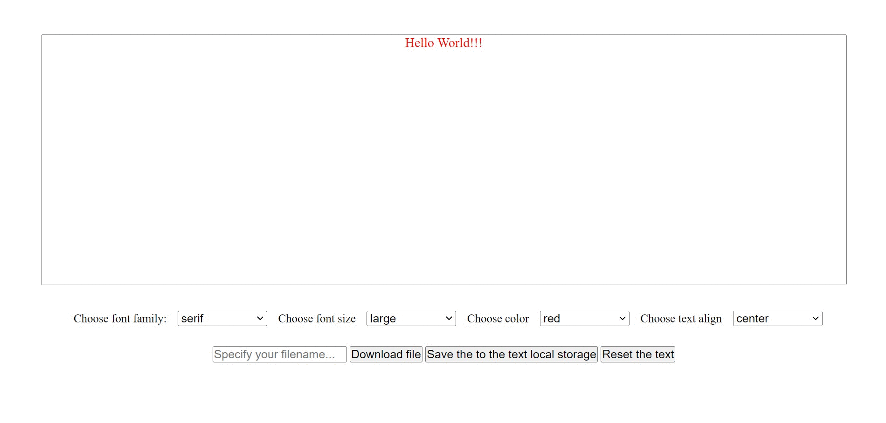

## Dynamic landing Page | JavaScript Project

👨‍💻 This project aims to improve my <b>HTML/CSS/JavaScript and DOM skills </b> 
  
🎯 This project shows how to build an interactive landing page that create/edit a text...
  
🍃 Also initial text message can be updated...
  
Text can be downloaded in notepad (.txt) and word (.doc) format...
  
🔗 To see live version 🎯
 

 ⌛ Happy Coding  ✍ 

  
🌐 The desktop version of the web page are as follows;🧭
  

## 🖥️Desktop version
 

 
 
 
 
 
 
 
 
 

